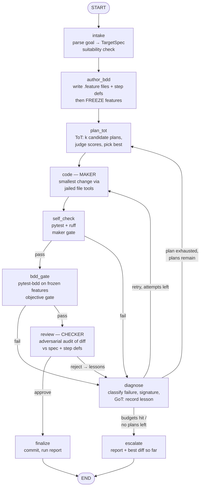

# CODING_ENGINEER — Non-Stop Coding Agent Plan

> Follow-on from `loop-engineering-report.md` (2026-07-23). This is a **plan only** — no code changes yet.
> Goal: add a new LangGraph-orchestrated agent to `app.py` that iterates on **code → test → BDD-verify** until a target is achieved, without human intervention, applying Tree-of-Thought (ToT) planning and Graph-of-Thought (GoT) lesson aggregation where they pay off.

---

## 1. Purpose

A fourth agent in the Streamlit app — **"Coding Engineer"** — that:

- Takes a **target folder** (any git repo the user points at) and a **natural-language goal**.
- Authors a verifiable definition-of-done as **Gherkin BDD scenarios** before writing any code.
- Iterates autonomously: plan → smallest change → unit tests → BDD gate → adversarial review — until the goal check passes or a stop rule fires.
- Never touches the user's checkout directly: every run happens in a **git worktree** on its own branch; the human reviews the final diff. No auto-merge, ever.

This is a **goal loop** in the report's taxonomy (§6), implementing all six primitives: the LangGraph graph is the automation, worktrees give isolation, prompts/skills codify project knowledge, subprocess tools are the connectors, maker/checker are sub-agent roles, and `.loop/state/` is durable memory.

### Suitability test (report §4)

| Condition | Verdict |
|---|---|
| Repetitive? | Yes — the code/test/fix cycle is the loop body. |
| Verifiable success? | Yes — frozen BDD scenarios + pytest are the objective gate. |
| Reversible / low-risk? | Yes — worktree branch, diff-only output, human merges. |
| Cost bounded? | Yes — attempt caps, recursion limit, wall-clock and token budgets. |

Out of scope (by the report's own rules): architecture decisions, auth/payment code, deploys, vague goals. The intake node rejects goals it cannot turn into checkable scenarios — that *is* the suitability gate at runtime.

---

## 2. Design principles (from the report)

1. **Two gates, not one.** Maker self-check (`pytest` + `ruff`) is fast feedback; the independent goal check (frozen BDD suite + adversarial reviewer) decides "done". The maker never grades its own homework.
2. **Frozen goal.** BDD `.feature` files are authored once at intake, then become **read-only to the coder** (enforced by the file-tool jail). The agent cannot weaken its own definition of done.
3. **No-progress detection.** Same failure signature twice in a row → the active plan is exhausted immediately (anti "Ralph-Wiggum runaway").
4. **State on disk.** `.loop/state/coding-engineer/<run_id>.json` + SqliteSaver checkpoints — a killed run resumes where it stopped.
5. **Stay the engineer.** Output is a branch + diff + run report. The human reads and merges.

---

## 3. Architecture

### 3.1 Graph topology



`displayGraph()` in `app.py` renders this automatically via `get_graph(xray=True)` — no extra work.

### 3.2 State schema

```python
class Budgets(TypedDict):
    max_attempts_per_plan: int   # default 3
    max_plans: int               # default 3
    max_total_attempts: int      # default 9
    cmd_timeout_s: int           # default 120 per subprocess
    wall_clock_s: int            # default 1800
    token_budget: int            # 0 = unlimited; tallied via telemetry

class Plan(TypedDict):
    id: str
    steps: list[str]
    rationale: str
    score: float                 # judge's composite score
    status: str                  # untried | active | exhausted

class Lesson(TypedDict):        # a node in the thought graph (GoT)
    attempt: int
    plan_id: str
    failure_signature: str       # normalised: (phase, test id, error class, top frame)
    insight: str                 # one-sentence takeaway from diagnose

class CodingLoopState(TypedDict):
    # immutable per run
    run_id: str
    target_dir: str
    worktree_dir: str
    branch: str                  # e.g. coding-engineer/<run_id>
    goal: str
    budgets: Budgets
    # goal definition
    spec: dict                   # structured acceptance criteria, in-scope files, commands
    feature_paths: list[str]     # frozen after author_bdd
    # planning
    candidate_plans: list[Plan]
    active_plan_id: str
    lessons: list[Lesson]        # the GoT substrate
    # iteration
    attempt: int                 # within active plan
    total_attempts: int
    last_diff: str
    test_report: dict            # parsed pytest json
    bdd_report: dict
    failure_signature: str | None
    prev_failure_signature: str | None
    review: dict | None          # verdict + findings
    # outcome + UI
    status: str                  # planning|coding|testing|review|done|escalated
    messages: Annotated[list, add_messages]   # streamed to Streamlit
```

Checkpointer: `SqliteSaver` (file-backed, not `:memory:` — resumability is the point), `thread_id = run_id`. Same pattern as `RAGResearchChatbot`/`ArticleWriterStateMachine`, but persisted under `.loop/state/coding-engineer/checkpoints.db`.

### 3.3 Node specs

**intake** — LLM (structured output) parses goal + target dir into a `TargetSpec`: acceptance criteria, in-scope files, test command, constraints. Rejects (→ escalate with reason) if criteria aren't checkable. Creates the worktree: `git worktree add <.loop/worktrees/run_id> -b coding-engineer/<run_id>` from the target repo; falls back to temp-dir copy + `git init` for non-git targets.

**author_bdd** — LLM writes `features/*.feature` (Gherkin) + `features/steps/` (or pytest-bdd step defs) expressing the acceptance criteria, plus any missing pytest scaffolding. After this node, feature files enter the jail's **read-only set**. Rationale: BDD-first makes the goal executable and human-readable; freezing prevents the maker gaming the gate.

**plan_tot** — Tree-of-Thought (Yao et al. 2023), sized for a local Ollama model:
- *Propose*: one call at temperature ≈0.8 generates **k=3** distinct plans (structured output).
- *Evaluate*: separate judge call at temperature 0 scores each on goal-fit, simplicity, risk, testability.
- *Select*: highest-scoring plan not marked `exhausted` becomes active. Rejected branches are kept in state — they're re-scored, not regenerated, on re-entry.
- On re-entry after a plan dies, the prompt includes the **aggregated lessons** (see diagnose) — this is the GoT step: insights from multiple failed branches merge into the next choice, which pure tree search can't do (Besta et al. 2023).
- Deliberately *not* parallel beam execution: sequential fallback keeps token cost sane on local models. Branching lives in planning, not in execution.

**code (maker)** — tool-calling agent (same `create_agent`/`AgentExecutor` pattern as `web_researcher.py`) with jailed tools: `read_file`, `write_file`, `apply_patch`, `list_dir`, `run_command` (allowlisted binaries only). Prompt: current plan step, last failure + lesson, "make the **smallest change** that could pass". Writes only inside the worktree, never to frozen features.

**self_check** — no LLM. Runs `ruff check` then `pytest -q --json-report` via subprocess (timeout per `budgets.cmd_timeout_s`). Parses to `test_report`.

**bdd_gate** — no LLM. Runs the frozen scenario suite (`pytest features/ -q` with pytest-bdd). This is the objective half of the checker gate.

**diagnose** — LLM classifies the failure (syntax | test-logic | env | flake | design), computes the normalised `failure_signature`, and appends a one-line `Lesson`. Routing logic (pure code, no LLM):
- signature == previous signature → active plan `exhausted` (no-progress rule);
- attempts left on plan and new signature → back to **code**;
- plan exhausted, plans remain, total budget ok → back to **plan_tot**;
- otherwise → **escalate**.

**review (checker)** — adversarial sub-agent, separate prompt ("assume the maker is wrong; find where the diff satisfies the letter of the tests but not the spec"), temperature 0, model from `CHECKER_MODEL` env var (defaults to `OLLAMA_MODEL`; a different model is better when available). Sees **spec + diff + step definitions + test output** — not the maker's reasoning, to avoid contamination. Specifically audits step defs for trivial-pass hacks (its job since the maker wrote them under frozen `.feature` files). Reject findings become lessons → diagnose.

**finalize** — commits to the run branch, writes `run-report.md` (goal, plan history, attempts, lessons, final test/BDD output, diff stat) into `.loop/state/coding-engineer/<run_id>/`, updates the state JSON. Optional later: `gh pr create`.

**escalate** — same report plus best-so-far diff and the reason (budget | no-progress | unsuitable goal). Worktree is left in place for the human.

### 3.4 Where ToT/GoT apply — and where they don't

| Phase | Technique | Why |
|---|---|---|
| Planning | **ToT** (propose-k / judge / select) | Solution strategy is the highest-leverage branch point; cheap to explore as text. |
| Re-planning after failures | **GoT** (lesson aggregation across dead branches) | Failures on plan A inform plan C; merging insights is a graph operation, not a tree one. |
| Coding / fixing | **Neither** — single chain + tests | Real feedback (pytest output) beats simulated deliberation; tests are a better judge than an LLM. |
| Review | Adversarial single agent | Maker/checker split matters more than search here. |

This keeps LLM spend focused where the report's economics section says it should be: deliberation is cheap at plan level, expensive at execution level.

---

## 4. Safety rails

| Rail | Implementation |
|---|---|
| Filesystem jail | All file tools resolve paths, reject anything outside `worktree_dir`; frozen features + `.git` internals in a read-only set. |
| Command allowlist | `run_command` permits only `pytest`, `ruff`, `python`, `git` (status/diff/add/commit inside worktree). No `pip install` by default (opt-in flag). |
| Timeouts | `subprocess.run(args_list, timeout=...)` — list args, no shell, Windows-safe. |
| Stop rules | attempts caps, no-progress detection, `recursion_limit≈150`, wall-clock check in diagnose, token tally via `telemetry.extract_token_usage`. |
| Blast radius | Worktree branch only; user's checkout untouched; human merges. |

---

## 5. Repo changes (when implemented)

```
langgraph_ollama/
├── coding_engineer.py        # NEW — graph, state, nodes (CodingEngineer class, .create_graph())
├── coding_prompts.py         # NEW — intake/planner/judge/maker/diagnose/reviewer prompts
├── tools/
│   ├── code_exec.py          # NEW — jailed file tools + allowlisted run_command
│   └── worktree.py           # NEW — worktree create/cleanup, diff, commit helpers
├── sample_target/            # NEW — tiny demo repo (kata + failing feature file) for demos/tests
├── tests/                    # NEW — unit tests for jail, runner, signatures, routing
├── app.py                    # MODIFIED — see below
└── pyproject.toml            # MODIFIED — add: pytest, pytest-bdd, pytest-json-report, ruff
```

BDD runner choice: **pytest-bdd** over behave — one test runner for both gates, plays with `pytest --json-report`, one dependency family.

### app.py integration (minimal diff)

- `CODING_ENGINEER = "Coding Engineer"`; `CHAIN_CONFIG` entry with `models: [os.getenv('OLLAMA_MODEL')]`, `support_types: []`.
- `build_chain` branch → `CodingEngineer(llm).create_graph()` (graph display works as-is).
- When selected: inputs for target dir (default `sample_target/`), goal textarea (reuses existing query box), budgets expander in the sidebar.
- Run via `graph.stream(state, config, stream_mode="updates")` inside `st.status` — per-node progress line (node name, attempt, gate results), matching the Internet Researcher streaming pattern. Wrap in `telemetry.track_request(CODING_ENGINEER, model)`; `record_tokens` per node update.
- On finish: verdict banner, diff viewer (`st.code`), link to `run-report.md`, branch name to review.
- `DEMO_QUERIES[CODING_ENGINEER]`, e.g. *"In sample_target, implement the string-calculator kata so all scenarios in features/calculator.feature pass."*

Env additions (`.env.example`): `CHECKER_MODEL` (optional), `CODING_ENGINEER_ALLOW_INSTALL=false`.

---

## 6. Delivery phases

| Phase | Scope | Acceptance criteria |
|---|---|---|
| **0 — Scaffolding** | `tools/code_exec.py`, `tools/worktree.py`, `sample_target/`, deps | Unit tests prove: jail blocks escapes + frozen writes; runner enforces timeout; worktree create/cleanup round-trips on Windows. |
| **1 — Linear loop** | intake → author_bdd → single fixed plan → code → self_check → bdd_gate → finalize | Solves the sample kata unattended from the CLI (`python coding_engineer.py`), ≤3 attempts, branch + report produced. |
| **2 — Rails & memory** | diagnose, signatures, no-progress, budgets, escalate, disk state, resume | Impossible goal escalates within budget; identical failure twice → plan exhausted; killed run resumes from checkpoint. |
| **3 — ToT / GoT / checker** | plan_tot (k=3 + judge), lesson aggregation, adversarial review, `CHECKER_MODEL` | Seeded bad plan → observable plan switch with lessons in report; seeded trivial-pass step def → reviewer rejects. |
| **4 — UI & polish** | app.py integration, streaming, telemetry, demo queries, README | End-to-end demo from Streamlit; graph diagram renders; tokens/latency visible in observability stack. |

Each phase is independently shippable; Phase 1 alone is already a working (if naive) non-stop agent.

---

## 7. Risks & mitigations

| Risk | Mitigation |
|---|---|
| Local-model structured-output brittleness (already seen in `mm_agent.py` JSON handling) | `with_structured_output` everywhere + one retry with error fed back; regex-free JSON repair fallback; judge/diagnose schemas kept tiny. |
| Maker games the gate | Frozen features, reviewer audits step defs, human merge. |
| Token runaway | Budgets in state, checked in diagnose; `recursion_limit`; report's routing advice — heavy prompts only in plan/review nodes. |
| Context rot on long runs | Nodes get curated state slices (spec, active plan, last failure, lessons digest) — never the full message history. |
| Streamlit rerun kills a long run | Checkpointed graph resumes by `run_id`; demo runs are minutes-scale; background execution is a Phase-5 option, not a blocker. |
| Windows quirks (paths, quoting) | `pathlib` throughout; subprocess list-args; worktree paths kept short under `.loop/worktrees/`. |
| Flaky tests → false failure signals | diagnose classifies `flake` → one free retry without burning an attempt. |

---

## 8. Open questions (for review before Phase 0)

1. Should author_bdd offer an **optional** HITL pause to approve scenarios before the loop goes non-stop (Article-Writer-style interrupt, default off)? Cheap insurance that the frozen goal matches intent.
2. Is a second local model available for `CHECKER_MODEL`? Maker/checker on the same model still helps (different prompt/temperature) but a different model catches more.
3. Python-only targets for v1? (Assumed yes — gates are pytest/ruff. Other stacks = pluggable gate commands later.)
4. Token budget enforcement: hard-stop mid-run, or warn-and-continue? (Plan assumes hard-stop at diagnose checkpoints.)

---

*Plan drafted 2026-07-24. Sources: `loop-engineering-report.md` (five primitives + memory, two gates, stop rules, suitability test); Yao et al., "Tree of Thoughts" (2023); Besta et al., "Graph of Thoughts" (2023); existing patterns in `web_researcher.py` (supervisor/agent nodes), `mm_agent.py` (maker/critique loop + interrupts), `rag_research_chatbot.py` (SqliteSaver + tool agents), `telemetry.py`.*
