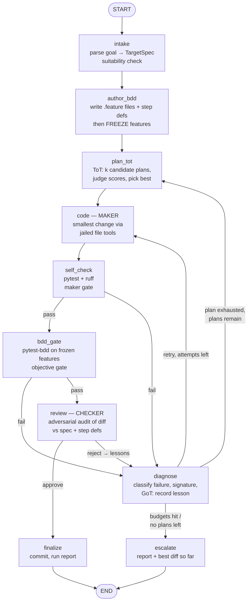
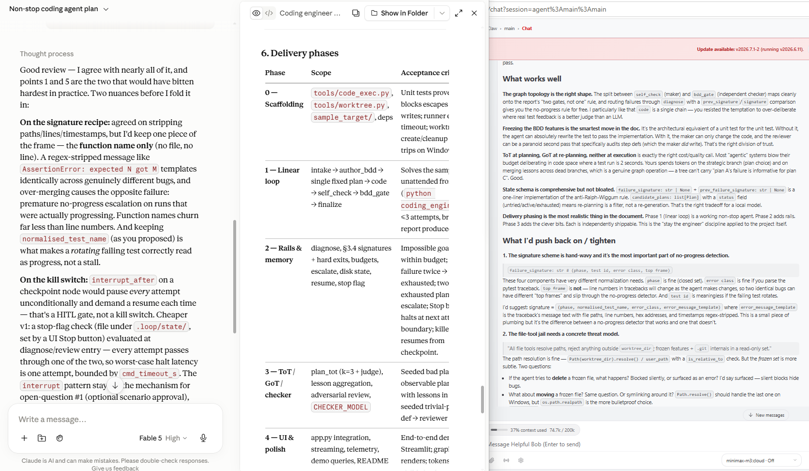

# CODING_ENGINEER — Non-Stop Coding Agent Plan

> Follow-on from `loop-engineering-report.md` (2026-07-23). This is a **plan only** — no code changes yet.
> Goal: add a new LangGraph-orchestrated agent to `app.py` that iterates on **code → test → BDD-verify** until a target is achieved, without human intervention, applying Tree-of-Thought (ToT) planning and Graph-of-Thought (GoT) lesson aggregation where they pay off.

---

## 1. Purpose

A fourth agent in the Streamlit app — **"Coding Engineer"** — that:

- Takes a **target folder** (any git repo the user points at) and a **natural-language goal**.
- Authors a verifiable definition-of-done as **Gherkin BDD scenarios** before writing any code.
- Iterates autonomously: plan → smallest change → unit tests → BDD gate → adversarial review — until the goal check passes or a stop rule fires.
- Never touches the user's checkout directly: every run happens in a **git worktree** on its own branch; the human reviews the final diff. No auto-merge, ever.

This is a **goal loop** in the report's taxonomy (§6), implementing all six primitives: the LangGraph graph is the automation, worktrees give isolation, prompts/skills codify project knowledge, subprocess tools are the connectors, maker/checker are sub-agent roles, and `.loop/state/` is durable memory.

### Suitability test (report §4)

| Condition | Verdict |
|---|---|
| Repetitive? | Yes — the code/test/fix cycle is the loop body. |
| Verifiable success? | Yes — frozen BDD scenarios + pytest are the objective gate. |
| Reversible / low-risk? | Yes — worktree branch, diff-only output, human merges. |
| Cost bounded? | Yes — attempt caps, recursion limit, wall-clock and token budgets. |

Out of scope (by the report's own rules): architecture decisions, auth/payment code, deploys, vague goals. The intake node rejects goals it cannot turn into checkable scenarios — that *is* the suitability gate at runtime.

---

## 2. Design principles (from the report)

1. **Two gates, not one.** Maker self-check (`pytest` + `ruff`) is fast feedback; the independent goal check (frozen BDD suite + adversarial reviewer) decides "done". The maker never grades its own homework.
2. **Frozen goal.** BDD `.feature` files are authored once at intake, then become **read-only to the coder** (enforced by the file-tool jail). The agent cannot weaken its own definition of done.
3. **No-progress detection.** Same failure signature twice in a row → the active plan is exhausted immediately (anti "Ralph-Wiggum runaway").
4. **State on disk.** `.loop/state/coding-engineer/<run_id>.json` + SqliteSaver checkpoints — a killed run resumes where it stopped.
5. **Stay the engineer.** Output is a branch + diff + run report. The human reads and merges.

---

## 3. Architecture

### 3.1 Graph topology


```mermaid
graph TD
    START([START]) --> intake[intake<br/>parse goal → TargetSpec<br/>suitability check]
    intake --> author_bdd[author_bdd<br/>write .feature files + step defs<br/>then FREEZE features]
    author_bdd --> plan_tot[plan_tot<br/>ToT: k candidate plans,<br/>judge scores, pick best]
    plan_tot --> code[code — MAKER<br/>smallest change via<br/>jailed file tools]
    code --> self_check[self_check<br/>pytest + ruff<br/>maker gate]
    self_check -->|pass| bdd_gate[bdd_gate<br/>pytest-bdd on frozen features<br/>objective gate]
    self_check -->|fail| diagnose
    bdd_gate -->|fail| diagnose[diagnose<br/>classify failure, signature,<br/>GoT: record lesson]
    bdd_gate -->|pass| review[review — CHECKER<br/>adversarial audit of diff<br/>vs spec + step defs]
    review -->|approve| finalize[finalize<br/>commit, run report]
    review -->|reject → lessons| diagnose
    diagnose -->|retry, attempts left| code
    diagnose -->|plan exhausted,<br/>plans remain| plan_tot
    diagnose -->|budgets hit /<br/>no plans left| escalate[escalate<br/>report + best diff so far]
    finalize --> END([END])
    escalate --> END
```

`displayGraph()` in `app.py` renders this automatically via `get_graph(xray=True)` — no extra work.

### 3.2 State schema

```python
class Budgets(TypedDict):
    max_attempts_per_plan: int   # default 3
    max_plans: int               # default 3
    max_total_attempts: int      # default 9
    cmd_timeout_s: int           # default 120 per subprocess
    wall_clock_s: int            # default 1800
    token_budget: int            # 0 = unlimited; tallied via telemetry

class Plan(TypedDict):
    id: str
    steps: list[str]
    rationale: str
    score: float                 # judge's composite score
    status: str                  # untried | active | exhausted

class Lesson(TypedDict):        # a node in the thought graph (GoT)
    attempt: int
    plan_id: str
    failure_signature: str       # normalised — recipe in §3.4
    insight: str                 # one-sentence takeaway from diagnose

class CodingLoopState(TypedDict):
    # immutable per run
    run_id: str
    target_dir: str
    worktree_dir: str
    branch: str                  # e.g. coding-engineer/<run_id>
    goal: str
    budgets: Budgets
    # goal definition
    spec: dict                   # structured acceptance criteria, in-scope files, commands
    feature_paths: list[str]     # frozen after author_bdd
    # planning
    candidate_plans: list[Plan]
    active_plan_id: str
    lessons: list[Lesson]        # the GoT substrate
    hitl_bdd_approval: bool      # from CODING_AGENT_HITL_BDD_APPROVAL, default False
    bdd_ambiguity_reason: str | None   # set by author_bdd if it judges a pause warranted
    # iteration
    attempt: int                 # within active plan
    total_attempts: int
    last_diff: str
    test_report: dict            # parsed pytest json
    bdd_report: dict
    failure_signature: str | None
    prev_failure_signature: str | None
    review: dict | None          # verdict + findings
    # outcome + UI
    status: str                  # planning|coding|testing|review|done|escalated
    messages: Annotated[list, add_messages]   # streamed to Streamlit
```

Checkpointer: `SqliteSaver` (file-backed, not `:memory:` — resumability is the point), `thread_id = run_id`. Same pattern as `RAGResearchChatbot`/`ArticleWriterStateMachine`, but persisted under `.loop/state/coding-engineer/checkpoints.db`.

### 3.3 Node specs

**intake** — LLM (structured output) parses goal + target dir into a `TargetSpec`: acceptance criteria, in-scope files, test command, constraints. Rejects (→ escalate with reason) if criteria aren't checkable. Creates the worktree: `git worktree add <.loop/worktrees/run_id> -b coding-engineer/<run_id>` from the target repo; falls back to temp-dir copy + `git init` for non-git targets.

**author_bdd** — LLM writes `features/*.feature` (Gherkin) + `features/steps/` (or pytest-bdd step defs) expressing the acceptance criteria, plus any missing pytest scaffolding. After this node, feature files enter the jail's **read-only set**. Rationale: BDD-first makes the goal executable and human-readable; freezing prevents the maker gaming the gate.

*Optional HITL pause (default off).* If `hitl_bdd_approval` is set, the same call that drafts the scenarios also self-assesses ambiguity and returns `{scenarios, ambiguity: bool, ambiguity_reason}`. Only when `ambiguity` is true does the node call `interrupt()` (same mechanism as `mm_agent.py`'s `HumanReviewAgent`/`interrupt_after`, reusing the checkpointer already in §3.2) to surface the draft + reason for edit-or-approve; a false reading of `ambiguity`, or the flag being off, proceeds straight to freezing with zero human input. The prompt is explicit that this is a last resort, not a courtesy check: *"Only pause if you genuinely cannot derive checkable acceptance criteria from the goal, or a reasonable second reading of the goal would produce materially different scenarios. Do not pause to confirm something you can reasonably infer — the agent is expected to act autonomously; treat interruption as an exception, not a step."* This keeps the escape hatch cheap without turning it into a routine gate — the report's "stay the engineer" principle applied narrowly, at the one point where getting the frozen goal wrong is unrecoverable later.

**plan_tot** — Tree-of-Thought (Yao et al. 2023), sized for a local Ollama model:
- *Propose*: one `primary`-role call at temperature ≈0.8 generates **k=3** distinct plans (structured output).
- *Evaluate*: separate `secondary`-role judge call at temperature 0 scores each on goal-fit, simplicity, risk, testability — same maker/checker principle applied to planning: the model that proposed a plan shouldn't be the one scoring it, when a distinct secondary model is configured (§3.5). Falls back to the same model transparently otherwise.
- *Select*: highest-scoring plan not marked `exhausted` becomes active. Rejected branches are kept in state — they're re-scored, not regenerated, on re-entry.
- On re-entry after a plan dies, the prompt includes the **aggregated lessons** (see diagnose) — this is the GoT step: insights from multiple failed branches merge into the next choice, which pure tree search can't do (Besta et al. 2023).
- Deliberately *not* parallel beam execution: sequential fallback keeps token cost sane on local models. Branching lives in planning, not in execution.

**code (maker)** — tool-calling agent (same `create_agent`/`AgentExecutor` pattern as `web_researcher.py`) with jailed tools: `read_file`, `write_file`, `apply_patch`, `list_dir`, `run_command` (allowlisted binaries only). Prompt: current plan step, last failure + lesson, "make the **smallest change** that could pass". Writes only inside the worktree, never to frozen features.

**self_check** — no LLM. Runs `ruff check` then `pytest -q --json-report` via subprocess (timeout per `budgets.cmd_timeout_s`). Parses to `test_report`.

**bdd_gate** — no LLM. Runs the frozen scenario suite (`pytest features/ -q` with pytest-bdd). This is the objective half of the checker gate.

**diagnose** — LLM classifies the failure (syntax | test-logic | env | flake | design), computes the `failure_signature` (recipe in §3.4), and appends a one-line `Lesson`. Routing is pure code, no LLM: run the §3.4 hard-exit checks in order; else retry **code** while attempts remain on the plan; else next plan via **plan_tot**. A `flake` classification gets one free retry without burning an attempt. Diagnose entry (and review entry) also checks the **stop flag** — see §4.

**review (checker)** — adversarial sub-agent, separate prompt ("assume the maker is wrong; find where the diff satisfies the letter of the tests but not the spec"), temperature 0, always the `secondary` role (§3.5) — a different model catches more than a different prompt on the same model, and this is the node where that matters most. Sees **spec + diff + step definitions + test output** — not the maker's reasoning, to avoid contamination. Specifically audits step defs for trivial-pass hacks (its job since the maker wrote them under frozen `.feature` files). Output is structured, never prose:

```python
class Finding(TypedDict):
    location: str        # file:symbol
    severity: str        # blocker | major | minor
    rationale: str
    suggested_fix: str

class ReviewVerdict(TypedDict):
    verdict: str         # approve | approve_with_notes | reject
    findings: list[Finding]
```

Only `blocker`/`major` findings may produce `reject`; `minor`-only → `approve_with_notes` (notes land in the run report, not back in the loop). Each rejecting finding maps 1:1 onto a `Lesson` and gets a failure signature (§3.4), so a maker/checker stalemate is caught by the same no-progress rule as test failures.

**finalize** — commits to the run branch, writes `run-report.md` (goal, plan history, attempts, lessons, final test/BDD output, diff stat) into `.loop/state/coding-engineer/<run_id>/`, updates the state JSON. Optional later: `gh pr create`.

**escalate** — same report plus best-so-far diff and the reason (budget | no-progress | unsuitable goal). Worktree is left in place for the human.

### 3.4 Failure signatures & hard exits

The no-progress detector is only as good as its signature normalisation, so the recipe is spec, not implementation detail:

```
signature = sha1(phase | normalised_test_name | error_class | message_template | top_frame_func)
```

- `phase`: `self_check | bdd_gate | review` (closed set).
- `normalised_test_name`: pytest nodeid minus parametrisation suffix (`test_add[3-5]` → `test_add`). Keeping the test name is what makes a *different* failing test correctly read as progress rather than a stall.
- `error_class`: exception type from the parsed traceback.
- `message_template`: exception message with file paths, line numbers, hex addresses, durations and timestamps regex-stripped.
- `top_frame_func`: **function name only** from the innermost in-worktree frame — no file, no line number (line numbers churn as the agent edits). Tiebreaker so generic templates (`AssertionError: expected N got M`) don't over-merge distinct bugs into a premature no-progress verdict.

Reviewer rejections are signed too: `(review, finding.location, severity)` per blocking finding — the maker/checker stalemate is no-progress by another name.

**Hard exits**, checked in `diagnose` in this order:

1. Same signature twice in a row → active plan `exhausted`.
2. **Two consecutive plans exhausted → escalate.** Don't try a third — lesson aggregation has steered into a local minimum, and a fresh plan built on the same lessons will land in the same place.
3. Reviewer rejects twice with the same signature → escalate (the checker isn't fixing the maker; iterating won't either).
4. Any budget breached (attempts, wall clock, tokens) → escalate. Token budget is a **hard stop** at this checkpoint, not a warning.

### 3.5 Model configuration — primary / secondary, provider-agnostic

Two roles, not two hardcoded models:

- **`primary`** — intake, author_bdd, plan_tot propose, code/maker, diagnose. The high-frequency, in-the-loop calls.
- **`secondary`** — plan_tot judge, review/checker. The independent-judgement calls, deliberately capable of being a *different* model.

```
CODING_AGENT_PRIMARY_PROVIDER=ollama
CODING_AGENT_PRIMARY_MODEL=${OLLAMA_MODEL}
CODING_AGENT_PRIMARY_BASE_URL=${OLLAMA_BASE_URL}

CODING_AGENT_SECONDARY_PROVIDER=ollama        # defaults to PRIMARY_PROVIDER if unset
CODING_AGENT_SECONDARY_MODEL=${OLLAMA_MODEL}  # point at a different model (or provider) to sharpen the checker
CODING_AGENT_SECONDARY_BASE_URL=${OLLAMA_BASE_URL}
```

`coding_agent/models.py` exposes one seam, `get_llm(role: Literal["primary", "secondary"]) -> BaseChatModel`, and every node goes through it — no node ever constructs a `ChatOllama` inline. Today the provider switch has one branch (`ollama`, mirroring `app.py`'s existing `get_llm()`); the switch statement is what makes adding `openai`/`anthropic` later a few lines in one file rather than touching every prompt call site. If `secondary` isn't configured, or resolves to the same provider+model as `primary`, judge/review calls still run — same maker/checker discipline, just without the model-diversity benefit — so the loop degrades gracefully rather than requiring a second model to function.

### 3.6 Where ToT/GoT apply — and where they don't

| Phase | Technique | Why |
|---|---|---|
| Planning | **ToT** (propose-k / judge / select) | Solution strategy is the highest-leverage branch point; cheap to explore as text. |
| Re-planning after failures | **GoT** (lesson aggregation across dead branches) | Failures on plan A inform plan C; merging insights is a graph operation, not a tree one. |
| Coding / fixing | **Neither** — single chain + tests | Real feedback (pytest output) beats simulated deliberation; tests are a better judge than an LLM. |
| Review | Adversarial single agent | Maker/checker split matters more than search here. |


---

## 4. Safety rails

| Rail | Implementation |
|---|---|
| Filesystem jail | Every mutating op (write, patch, **delete, move/rename**) funnels through one guard: `os.path.realpath` on both source and destination (symlink-proof, incl. Windows), `is_relative_to(worktree_dir)` check, then frozen-set check (feature files, `.git` internals). Violations are **surfaced to the maker as tool errors, never silently swallowed** — the error text is learning signal, and silent blocks hide bugs. |
| Command allowlist | Binaries: `pytest`, `ruff`, `python`. `git` narrowed to a **subcommand allowlist** (`status`, `diff`, `add`, `commit`, `log`, `rev-parse`); `-c`, `--exec*`, `--upload-pack`, hooks-path and editor flags rejected outright. No `pip install` unless `CODING_AGENT_ALLOW_INSTALL=true`. |
| Subprocess hygiene | `cwd=worktree_dir` always — never inherited. Sanitised env (minimal `PATH`, `GIT_*` stripped). `subprocess.run(args_list, timeout=...)` — list args, no shell, Windows-safe. |
| Stop rules | attempts caps, §3.4 hard exits, `recursion_limit≈150`, wall-clock check in diagnose, token tally via `telemetry.extract_token_usage`. |
| Kill switch | UI Stop button writes a **stop flag** (`.loop/state/coding-engineer/<run_id>/STOP`); diagnose and review entry check it — every attempt passes through one of the two, so worst-case halt latency is one attempt, bounded by `cmd_timeout_s`. Flag → escalate("stopped by user"); run can resume by `run_id` or be abandoned cleanly. (Deliberately *not* `interrupt_after` on every attempt — that pauses unconditionally and demands a resume each cycle, which is a HITL gate, not a kill switch. The interrupt pattern is reserved for optional scenario approval, §8 Q1.) |
| Blast radius | Worktree branch only; user's checkout untouched; human merges. |

---

## 5. Repo changes (when implemented)

All new code is isolated under one package, `coding_agent/` — it doesn't spread into the existing top-level modules, and it doesn't collide with the existing `tools/` package (`mcp_notes.py`, `rag.py`), which stays untouched:

```
langgraph_ollama/
├── coding_agent/
│   ├── __init__.py
│   ├── engine.py              # NEW — graph, state, nodes (CodingEngineer class, .create_graph())
│   ├── prompts.py             # NEW — intake/planner/judge/maker/diagnose/reviewer prompts
│   ├── models.py              # NEW — primary/secondary model config, provider seam (§3.5)
│   ├── tools/
│   │   ├── __init__.py
│   │   ├── code_exec.py       # NEW — jailed file tools + allowlisted run_command
│   │   └── worktree.py        # NEW — worktree create/cleanup, diff, commit helpers
│   ├── sample_target/         # NEW — tiny demo repo (kata + failing feature file) for demos/tests
│   └── tests/                 # NEW — unit tests for jail, runner, signatures, routing
├── app.py                     # MODIFIED — see below
└── pyproject.toml             # MODIFIED — add: pytest, pytest-bdd, pytest-json-report, ruff
```

Runtime state (`.loop/state/coding-engineer/...`) stays at the repo root, alongside the existing `.cache/` — it's generated state, not code, so it doesn't move under `coding_agent/`.

BDD runner choice: **pytest-bdd** over behave — one test runner for both gates, plays with `pytest --json-report`, one dependency family.

### app.py integration (minimal diff)

- `from coding_agent.engine import CodingEngineer`; `CODING_ENGINEER = "Coding Engineer"`; `CHAIN_CONFIG` entry with `models: [os.getenv('OLLAMA_MODEL')]`, `support_types: []`.
- `build_chain` branch → `CodingEngineer().create_graph()` — model selection happens inside via `coding_agent.models.get_llm()` (§3.5), not the `get_llm(model_selection)` helper in `app.py` (graph display works as-is).
- When selected: inputs for target dir (default `coding_agent/sample_target/`), goal textarea (reuses existing query box), budgets expander in the sidebar.
- Run via `graph.stream(state, config, stream_mode="updates")` inside `st.status` — per-node progress line (node name, attempt, gate results), matching the Internet Researcher streaming pattern. Wrap in `telemetry.track_request(CODING_ENGINEER, model)`; `record_tokens` per node update.
- On finish: verdict banner, diff viewer (`st.code`), link to `run-report.md`, branch name to review.
- `DEMO_QUERIES[CODING_ENGINEER]`, e.g. *"In coding_agent/sample_target, implement the string-calculator kata so all scenarios in features/calculator.feature pass."*

Env additions (`.env.example`): `CODING_AGENT_PRIMARY_MODEL`/`_PROVIDER`/`_BASE_URL`, `CODING_AGENT_SECONDARY_MODEL`/`_PROVIDER`/`_BASE_URL` (all optional, default to `OLLAMA_MODEL`/`OLLAMA_BASE_URL`/`ollama`), `CODING_AGENT_HITL_BDD_APPROVAL=false`, `CODING_AGENT_ALLOW_INSTALL=false`.

---

## 6. Delivery phases

| Phase | Scope | Acceptance criteria |
|---|---|---|
| **0 — Scaffolding** | `coding_agent/tools/code_exec.py`, `coding_agent/tools/worktree.py`, `coding_agent/models.py`, `coding_agent/sample_target/`, deps | Unit tests prove: jail blocks escapes + frozen writes; runner enforces timeout; worktree create/cleanup round-trips on Windows; `get_llm("primary"/"secondary")` resolves correctly with and without secondary env vars set. |
| **1 — Linear loop** | intake → author_bdd (HITL flag off) → single fixed plan → code → self_check → bdd_gate → finalize | Solves the sample kata unattended from the CLI (`python -m coding_agent.engine`), zero human input, ≤3 attempts, branch + report produced. |
| **2 — Rails & memory** | diagnose, §3.4 signatures + hard exits, budgets, escalate, disk state, resume, stop flag, author_bdd interrupt (HITL flag on) | Impossible goal escalates within budget; identical failure twice → plan exhausted; two exhausted plans → escalate; Stop button halts at next attempt boundary; killed run resumes from checkpoint; with HITL on, a deliberately ambiguous goal pauses for approval and a clear goal does not. |
| **3 — ToT / GoT / checker** | plan_tot (k=3 + judge on `secondary`), lesson aggregation, adversarial review on `secondary` | Seeded bad plan → observable plan switch with lessons in report; seeded trivial-pass step def → reviewer rejects; run with a distinct `CODING_AGENT_SECONDARY_MODEL` demonstrably uses it for judge + review calls (visible in telemetry spans). |
| **4 — UI & polish** | app.py integration, streaming, telemetry, demo queries, README | End-to-end demo from Streamlit; graph diagram renders; tokens/latency visible in observability stack. |

Each phase is independently shippable; Phase 1 alone is already a working (if naive) non-stop agent.

---

## 7. Risks & mitigations

Repo-specific risks only — the generic loop failure modes (token runaway, context rot, overconfident termination) are covered by the report's §7–§8 rails, all adopted above.

| Risk | Mitigation |
|---|---|
| Local-model structured-output brittleness (already seen in `mm_agent.py` JSON handling) | `with_structured_output` everywhere + one retry with the error fed back; judge/diagnose/review schemas kept tiny. |
| Maker games the gate | Frozen features, reviewer audits step defs, human merge. |
| Context rot on long runs | Nodes get curated state slices (spec, active plan, last failure, lessons digest) — never the full message history. |
| Streamlit rerun kills a long run | Checkpointed graph resumes by `run_id`; stop flag gives a clean halt; background execution is a later option, not a blocker. |
| Windows quirks (paths, quoting) | `pathlib` + `os.path.realpath`; subprocess list-args; worktree paths kept short under `.loop/worktrees/`. |

---

## 8. Open questions — resolved

All four have been folded into the design above; kept here as a decision log.

1. **HITL pause in author_bdd?** Yes, optional and default off (`CODING_AGENT_HITL_BDD_APPROVAL`) — see §3.3. The node self-assesses ambiguity and only interrupts when it judges the frozen goal could plausibly diverge from intent; the prompt explicitly frames interruption as a last resort so it doesn't erode the agent's autonomy by default.
2. **Second model for the checker role?** Made general rather than answered once: `primary`/`secondary` are configurable independently (§3.5), provider-agnostic from day one so a future move off Ollama is a config change, not a rewrite. Secondary defaults to primary if unset — the loop works with one model, sharpens with two.
3. v1 targets are **Python-only** (gates are pytest/ruff; other stacks become pluggable gate commands later).
4. Token budget is a **hard stop** at the §3.4 checkpoint, not a warning.

---

*Plan drafted 2026-07-24. Sources: `loop-engineering-report.md` (five primitives + memory, two gates, stop rules, suitability test); Yao et al., "Tree of Thoughts" (2023); Besta et al., "Graph of Thoughts" (2023); existing patterns in `web_researcher.py` (supervisor/agent nodes), `mm_agent.py` (maker/critique loop + interrupts), `rag_research_chatbot.py` (SqliteSaver + tool agents), `telemetry.py`.*


