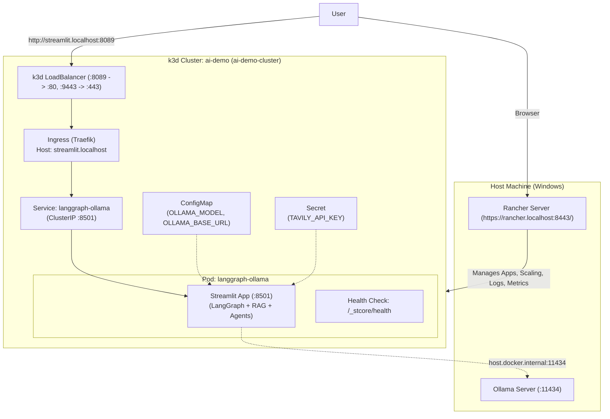

# Containerization and Rancher Deployment Guide for LangGraph Streamlit App

This document provides a step-by-step guide to containerize the LangGraph Multi-Agent Streamlit application (`app.py`), create a local **`k3d`** cluster, import it into **Rancher** (`https://rancher.localhost:8443/`), and deploy via **Helm** (or raw Kubernetes manifests).

---

## 1. Architecture Overview



### Key Considerations

1. **Host-to-Container Networking**: The containerized app inside Kubernetes reaches Ollama on the host via `http://host.docker.internal:11434`.
2. **Port Conflict Avoidance**: Rancher is already using port `8443`. We map k3d load balancer ports to **`8089:80`** and **`9443:443`** to avoid port collisions.
3. **Local Docker Image in k3d**: `k3d` runs its own containerd runtime, so locally built Docker images must be imported using `k3d image import`.
4. **Streamlit Ingress & WebSockets**: Ingress is configured with WebSocket timeouts and routes through `http://streamlit.localhost:8089/`.

---

## 2. Containerization Artifacts

### 2.1 `docker/Dockerfile` (Using `uv` directly)

Leverages the official `ghcr.io/astral-sh/uv` binary for ultra-fast, reproducible builds directly from `uv.lock`:

- Base: `python:3.12-slim-bookworm`
- Fast dependency installer: `COPY --from=ghcr.io/astral-sh/uv:latest /uv /uvx /bin/`
- OS Dependencies: `graphviz`, `curl`, `build-essential`
- Locked environment sync: `uv sync --frozen --no-dev --extra observability`
- Virtualenv in `/app/.venv` added to `PATH` (`ENV PATH="/app/.venv/bin:$PATH"`)
- Dedicated non-root user `appuser` (UID 10001) with direct `COPY --chown=appuser:appuser` (eliminates slow `chown -R` step)
- Expose port `8501`
- Built-in `HEALTHCHECK` probing `http://localhost:8501/_stcore/health`
- Entrypoint: `streamlit run app.py`

### 2.2 `.dockerignore`

Excludes `.venv`, git caches, `.env` files, logs, and build caches to ensure clean, lightweight builds.

---

## 3. Step-by-Step Setup & Deployment

### Step 1: Create the `k3d` Cluster (`ai-demo`)

Run in PowerShell:

```powershell
k3d cluster create ai-demo `
  --image rancher/k3s:v1.32.5-k3s1 `
  --api-port 6551 `
  -p "8089:80@loadbalancer" `
  -p "9443:443@loadbalancer" `
  --agents 1
```

---

### Step 2: Build the Container Image & Import into k3d

1. Build the Docker image locally:
   ```bash
   docker build -f docker/Dockerfile -t langgraph-ollama:latest .
   ```
2. Import the image into the `k3d` cluster (so Kubernetes pods can pull it locally):
   ```bash
   k3d image import langgraph-ollama:latest -c ai-demo
   ```

---

### Step 3: Import Cluster into Rancher (`https://rancher.localhost:8443/`)

1. Open Rancher in your browser: `https://rancher.localhost:8443/`.
2. Go to **Global Apps / Clusters** -> **Add Cluster** -> select **Generic (Import Existing Cluster)**.
3. Enter cluster name: `ai-demo-cluster`.
4. Click **Create** and copy the registration command shown on screen, for example:
   ```bash
   kubectl apply -f https://rancher.localhost:8443/v3/import/<token>.yaml
   ```

   *(If using self-signed certificates, use the curl/insecure variant provided by Rancher)*.
5. Wait for Rancher to connect and transition `ai-demo-cluster` to **Active**.

---

### Step 4: Deploy the Application

#### Option A: Deploy via Helm (Recommended for Rancher)

The Helm chart is located under [`helm/langgraph-ollama/`](file:///H:/code/yl/langgraph_ollama/helm/langgraph-ollama).

```powershell
# 1. Create namespace
kubectl create namespace ai-apps --dry-run=client -o yaml | kubectl apply -f -

# 2. Install / Upgrade the Helm chart
helm upgrade --install langgraph-app ./helm/langgraph-ollama `
  --namespace ai-apps `
  --set tavily.apiKey="YOUR_TAVILY_API_KEY"

# 3. Check deployment status
kubectl get pods,svc,ingress -n ai-apps
```

#### Option B: Deploy via Static Manifests (`k8s/`)

If you prefer applying static YAML files:

```powershell
kubectl apply -k k8s/
```

---

## 4. Accessing and Verifying the Application

### 1. Access via Ingress (k3d Load Balancer)

Open in your browser:

```text
http://streamlit.localhost:8089/
```

### 2. Access via Port-Forward (Direct Debugging)

```powershell
kubectl port-forward svc/langgraph-app-langgraph-ollama 8501:8501 -n ai-apps
```

Then navigate to `http://localhost:8501/`.

### 3. End-to-End Functional Test

- **RAG Chatbot Agent**: Test queries like `"Search my notes: what is the logical execution order of a SQL SELECT query?"` to verify connectivity to Ollama on host port 11434.
- **Internet Researcher**: Test queries to verify Tavily search and agent loop execution.
- **Rancher Dashboard**: Monitor live CPU/Memory utilization, view real-time streaming logs, and scale replicas directly from the Rancher UI.
