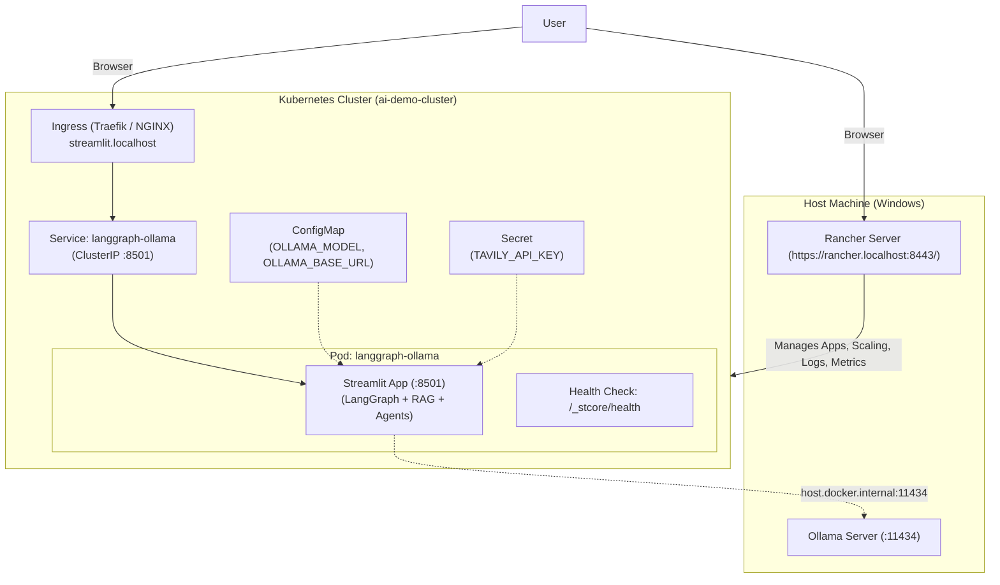

# Containerization and Rancher Deployment Plan for LangGraph Streamlit App

This document provides an end-to-end guide to containerize the LangGraph Multi-Agent Streamlit application (`app.py`) and deploy it to your local Rancher-managed Kubernetes cluster (**`ai-demo-cluster`**) at `https://rancher.localhost:8443/`.

---

## 1. Architecture Overview



### Key Considerations
1. **Host-to-Container Networking**: The containerized app inside Kubernetes reaches Ollama on the host via `http://host.docker.internal:11434` (configurable via `ollama.baseUrl` in Helm or `OLLAMA_BASE_URL` in ConfigMap).
2. **System Dependencies**: The app requires `graphviz` for rendering LangGraph flowcharts and document extraction packages.
3. **Streamlit Configuration**: Headless mode, custom port `8501`, CORS/XSRF settings configured to work smoothly behind Rancher / Ingress reverse proxies.
4. **Health Checks**: Streamlit native health check endpoint `/_stcore/health` wired into `livenessProbe` and `readinessProbe`.

---

## 2. Containerization Artifacts

### 2.1 `docker/Dockerfile` (Using `uv` directly)
Leverages the official `ghcr.io/astral-sh/uv` binary for ultra-fast, reproducible builds directly from `uv.lock`:
- Base: `python:3.12-slim-bookworm`
- Fast dependency installer: `COPY --from=ghcr.io/astral-sh/uv:latest /uv /uvx /bin/`
- OS Dependencies: `graphviz`, `curl`, `build-essential`
- Locked environment sync: `uv sync --frozen --no-dev --extra observability` (exact match with `uv.lock`)
- Virtualenv in `/app/.venv` added to `PATH` (`ENV PATH="/app/.venv/bin:$PATH"`)
- Dedicated non-root user `appuser` (UID 10001) with direct `COPY --chown=appuser:appuser` (eliminates slow `chown -R` step)
- Expose port `8501`
- Built-in `HEALTHCHECK` probing `http://localhost:8501/_stcore/health`
- Entrypoint: `streamlit run app.py`

### 2.2 `.dockerignore`
Excludes `.venv`, git caches, `.env` files, logs, and build caches to ensure clean, lightweight builds.

---

## 3. Building the Container Image

Run from the repository root:
```bash
docker build -f docker/Dockerfile -t langgraph-ollama:latest .
```

*Smoke test locally:*
```bash
docker run --rm -p 8501:8501 -e OLLAMA_BASE_URL=http://host.docker.internal:11434 langgraph-ollama:latest
```

---

## 4. Deployment Option 1: Helm Chart (Recommended for Rancher)

The Helm chart is located under [`helm/langgraph-ollama/`](file:///H:/code/yl/langgraph_ollama/helm/langgraph-ollama).

### 4.1 Chart Structure
```text
helm/langgraph-ollama/
├── Chart.yaml                  # Chart metadata (version 0.1.0)
├── values.yaml                 # Default configuration values
└── templates/
    ├── _helpers.tpl            # Helper templates and standard labels
    ├── deployment.yaml         # Deployment with probes and resource limits
    ├── service.yaml            # ClusterIP Service (port 8501)
    ├── configmap.yaml          # ConfigMap (Ollama base URL and model)
    ├── secret.yaml             # Secret (Tavily API key)
    ├── ingress.yaml            # Ingress with WebSocket annotations
    └── hpa.yaml                # Optional Horizontal Pod Autoscaler
```

### 4.2 Key Settings in `values.yaml`
```yaml
replicaCount: 1

image:
  repository: langgraph-ollama
  tag: "latest"
  pullPolicy: IfNotPresent

ollama:
  baseUrl: "http://host.docker.internal:11434"
  model: "glm-5.2:cloud"

tavily:
  apiKey: "your_tavily_api_key_here"

ingress:
  enabled: true
  hosts:
    - host: streamlit.localhost
      paths:
        - path: /
          pathType: Prefix
```

### 4.3 Deploy via Helm CLI
```bash
# 1. Create namespace (if not existing)
kubectl create namespace ai-apps

# 2. Install / Upgrade the Helm chart
helm upgrade --install langgraph-app ./helm/langgraph-ollama \
  --namespace ai-apps \
  --set tavily.apiKey="YOUR_ACTUAL_TAVILY_KEY"

# 3. Check deployment status
kubectl get pods,svc,ingress -n ai-apps
```

### 4.4 Deploy / Manage via Rancher UI (`https://rancher.localhost:8443/`)

1. **Open Cluster**: Navigate to `https://rancher.localhost:8443/` and select **`ai-demo-cluster`**.
2. **Apps & Marketplace**:
   - Go to **Apps** -> **Installed Apps**.
   - If using Helm repositories or Git repos in Rancher, add this repository under **Apps -> Repositories**.
   - You can configure the `values.yaml` directly in the visual UI editor in Rancher.
3. **Workload Management**:
   - In **Workloads** -> **Deployments**, inspect `langgraph-app` pods, view live logs, access pod shells, and monitor CPU/Memory metrics.
   - Adjust replica counts with a single click in Rancher.

---

## 5. Deployment Option 2: Static Kubernetes Manifests (`k8s/`)

If you prefer applying static YAML files without Helm, raw manifests are provided in [`k8s/`](file:///H:/code/yl/langgraph_ollama/k8s).

### 5.1 Manifest Files
- `k8s/namespace.yaml`: Defines `ai-apps` namespace
- `k8s/configmap.yaml`: `OLLAMA_MODEL` and `OLLAMA_BASE_URL`
- `k8s/secret.yaml`: `TAVILY_API_KEY`
- `k8s/deployment.yaml`: Deployment spec with probes and resources
- `k8s/service.yaml`: ClusterIP service on port 8501
- `k8s/ingress.yaml`: Ingress with WebSocket annotations
- `k8s/kustomization.yaml`: Kustomize aggregation bundle

### 5.2 Deploy via `kubectl`
```bash
# Apply all manifests via Kustomize
kubectl apply -k k8s/

# Verify
kubectl get all -n ai-apps
```

---

## 6. Accessing and Verifying the Application

1. **Access via Ingress**:
   - Open `http://streamlit.localhost/` (or your ingress controller port).
2. **Access via Port-Forward (Direct Debugging)**:
   ```bash
   kubectl port-forward svc/langgraph-app-langgraph-ollama 8501:8501 -n ai-apps
   ```
   Open `http://localhost:8501/` in your browser.
3. **End-to-End Agent Verification**:
   - Select **RAG Chatbot Agent** and test a query to confirm Ollama communication.
   - Select **Internet Researcher** to verify Tavily search integration.
