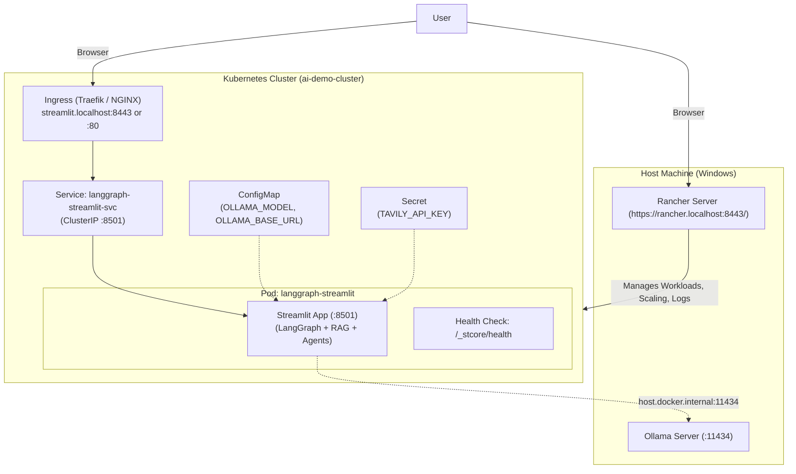

# Containerization and Rancher Deployment Plan for LangGraph Streamlit App

This document provides an end-to-end plan to containerize the LangGraph Multi-Agent Streamlit application (`app.py`) and deploy it to your local Rancher-managed Kubernetes cluster (**`ai-demo-cluster`**) at `https://rancher.localhost:8443/`.

---

## 1. Architecture Overview



### Key Considerations

1. **Host-to-Container Networking**: The containerized app inside Kubernetes needs to reach the Ollama service running on the host. We use `http://host.docker.internal:11434` as the default `OLLAMA_BASE_URL`.
2. **System Dependencies**: The app requires `graphviz` for rendering LangGraph flowcharts, and libraries for document extraction (`pymupdf`, `faiss-cpu`, etc.).
3. **Streamlit Configuration in Kubernetes**: Headless mode, custom port `8501`, CORS/XSRF settings configured to work smoothly behind Rancher / Ingress reverse proxies.
4. **Health Checks**: Streamlit native health check endpoint `/_stcore/health` will be wired into Kubernetes `livenessProbe` and `readinessProbe`.

---

## 2. Containerization Artifacts

### 2.1 `Dockerfile` (Using `uv` directly)

Leverages the official `ghcr.io/astral-sh/uv` binary for ultra-fast, reproducible builds directly from `uv.lock`:

- Base: `python:3.12-slim-bookworm`
- Fast dependency installer: `COPY --from=ghcr.io/astral-sh/uv:latest /uv /uvx /bin/`
- OS Dependencies: `graphviz`, `curl`
- Locked environment sync: `uv sync --frozen --no-dev --extra observability` (exact match with `uv.lock`)
- Virtualenv in `/app/.venv` added to `PATH` (`ENV PATH="/app/.venv/bin:$PATH"`)
- Dedicated non-root user `appuser` (UID 10001) for security
- Expose port `8501`
- Built-in `HEALTHCHECK` probing `http://localhost:8501/_stcore/health`
- Entrypoint: `streamlit run app.py`

#### Dockerfile Blueprint

```dockerfile
# syntax=docker/dockerfile:1
FROM python:3.12-slim-bookworm AS builder

# Install uv binary from official image
COPY --from=ghcr.io/astral-sh/uv:latest /uv /uvx /bin/

ENV UV_COMPILE_BYTECODE=1 \
    UV_LINK_MODE=copy \
    PYTHONUNBUFFERED=1

WORKDIR /app

# Install system dependencies
RUN apt-get update && apt-get install -y --no-install-recommends \
    graphviz \
    curl \
    && rm -rf /var/lib/apt/lists/*

# Install dependencies using uv.lock (cached layer)
RUN --mount=type=cache,target=/root/.cache/uv \
    --mount=type=bind,source=uv.lock,target=uv.lock \
    --mount=type=bind,source=pyproject.toml,target=pyproject.toml \
    uv sync --frozen --no-install-project --no-dev --extra observability

# Copy application source code
COPY . .

# Sync project itself
RUN --mount=type=cache,target=/root/.cache/uv \
    uv sync --frozen --no-dev --extra observability

# Runtime image
FROM python:3.12-slim-bookworm

WORKDIR /app

RUN apt-get update && apt-get install -y --no-install-recommends \
    graphviz \
    curl \
    && rm -rf /var/lib/apt/lists/*

# Copy virtualenv and app from builder
COPY --from=builder /app /app

# Configure non-root user
RUN useradd --create-home --uid 10001 appuser && \
    chown -R appuser:appuser /app

USER appuser

ENV PATH="/app/.venv/bin:$PATH" \
    PYTHONUNBUFFERED=1 \
    STREAMLIT_SERVER_PORT=8501 \
    STREAMLIT_SERVER_ADDRESS=0.0.0.0 \
    STREAMLIT_SERVER_HEADLESS=true \
    STREAMLIT_BROWSER_GATHER_USAGE_STATS=false

EXPOSE 8501

HEALTHCHECK --interval=30s --timeout=5s --start-period=10s --retries=3 \
    CMD curl -f http://localhost:8501/_stcore/health || exit 1

ENTRYPOINT ["streamlit", "run", "app.py"]
```

### 2.2 `.dockerignore`

Excludes virtual environments (`.venv`), git caches, `.env` files, logs, and build caches to ensure clean, lightweight builds.

### 2.3 Streamlit Config (`.streamlit/config.toml`)

Pre-configured for container runtime:

```toml
[server]
headless = true
address = "0.0.0.0"
port = 8501
enableCORS = false
enableXsrfProtection = false
maxUploadSize = 50

[browser]
gatherUsageStats = false
```

---

## 3. Kubernetes & Rancher Manifests (`k8s/`)

We will create ready-to-apply Kubernetes manifests in `k8s/`:

### 3.1 `k8s/configmap.yaml`

Stores non-sensitive configuration:

- `OLLAMA_MODEL`: e.g. `glm-5.2:cloud`
- `OLLAMA_BASE_URL`: `http://host.docker.internal:11434`
- `MD_MCP_URL`: optional connection to `md-mcp` service if deployed

### 3.2 `k8s/secret.yaml`

Stores API keys and sensitive tokens:

- `TAVILY_API_KEY`: encoded Tavily web search token

### 3.3 `k8s/deployment.yaml`

- Replicas: 1 (or scaled as needed)
- Image: `langgraph-ollama:latest` (imagePullPolicy: `IfNotPresent`)
- Resource limits and requests (e.g. CPU 250m/1000m, Memory 512Mi/2Gi)
- Probes:
  - `readinessProbe`: HTTP GET `/_stcore/health` on port 8501
  - `livenessProbe`: HTTP GET `/_stcore/health` on port 8501
- Environment variables imported from ConfigMap & Secret

### 3.4 `k8s/service.yaml`

- Type: `ClusterIP` (or `NodePort: 30501` for direct testing)
- Port: `8501` -> TargetPort: `8501`

### 3.5 `k8s/ingress.yaml`

- Ingress rule for routing `streamlit.localhost` or `langgraph.ai-demo.localhost` to `langgraph-streamlit-svc:8501`.
- Annotations for WebSocket support (essential for Streamlit interactive sessions).

### 3.6 `k8s/kustomization.yaml`

Single command deployment support: `kubectl apply -k k8s/`.

---

## 4. Rancher Management Workflow

### Method A: Deploy via Rancher UI (`https://rancher.localhost:8443/`)

1. **Access Cluster**:

   - Log in to `https://rancher.localhost:8443/`.
   - Select **`ai-demo-cluster`** from the cluster list.
2. **Create Project / Namespace**:

   - Navigate to **Cluster** -> **Projects/Namespaces**.
   - Create a namespace named `ai-apps`.
3. **Deploy Workload**:

   - Go to **Workloads** -> **Deployments** -> **Create**.
   - **Name**: `langgraph-streamlit`
   - **Namespace**: `ai-apps`
   - **Container Image**: `langgraph-ollama:latest` (or your registry image tag)
   - **Environment Variables**:
     - Add Key-Value: `OLLAMA_BASE_URL` = `http://host.docker.internal:11434`
     - Add Key-Value: `OLLAMA_MODEL` = `glm-5.2:cloud`
     - Add Secret Reference: `TAVILY_API_KEY`
   - **Health Check**:
     - Readiness Probe: HTTP GET `/_stcore/health` port `8501`, initial delay `10s`
     - Liveness Probe: HTTP GET `/_stcore/health` port `8501`, initial delay `20s`
4. **Expose Service & Ingress in Rancher**:

   - Go to **Service Discovery** -> **Services** -> Create `ClusterIP` service mapping port 8501 to 8501.
   - Go to **Service Discovery** -> **Ingresses** -> Create Ingress:
     - Host: `streamlit.localhost`
     - Path: `/` -> Target Service: `langgraph-streamlit-svc`, Port: `8501`.

---

### Method B: Deploy via CLI using Rancher Kubeconfig

1. **Download Kubeconfig from Rancher**:

   - In the Rancher UI on `ai-demo-cluster`, click **Kubeconfig** (top right) and save to `~/.kube/config` (or use Rancher CLI).
2. **Build and Load Docker Image**:

   ```bash
   # Build the container image using the docker/ folder Dockerfile
   docker build -f docker/Dockerfile -t langgraph-ollama:latest .
   ```
3. **Apply Manifests**:

   ```bash
   kubectl apply -k k8s/
   ```
4. **Verify Deployment in Rancher**:

   - Check Pod status:
     ```bash
     kubectl get pods -n ai-apps -w
     ```
   - In Rancher UI, view the workload in **`ai-demo-cluster`** -> **Workloads** -> **Deployments**. Real-time logs, CPU/memory graphs, and pod shell access are accessible directly from the Rancher dashboard.

---

## 5. Verification Plan

1. **Local Docker Image Smoke Test**:
   - Run: `docker run --rm -p 8501:8501 -e OLLAMA_BASE_URL=http://host.docker.internal:11434 langgraph-ollama:latest`
   - Verify `http://localhost:8501` loads without errors.
2. **Kubernetes Deployment Verification**:
   - Verify pod status `1/1 Running` and readiness probe succeeds.
3. **Rancher Dashboard Verification**:
   - Verify cluster `ai-demo-cluster` displays healthy deployment metrics.
   - Test scaling replicas from 1 to 2 via Rancher UI.
4. **End-to-End Functional Test**:
   - In the Streamlit UI, select **RAG Chatbot Agent**, trigger a canned query or upload a file, and verify response from Ollama.
