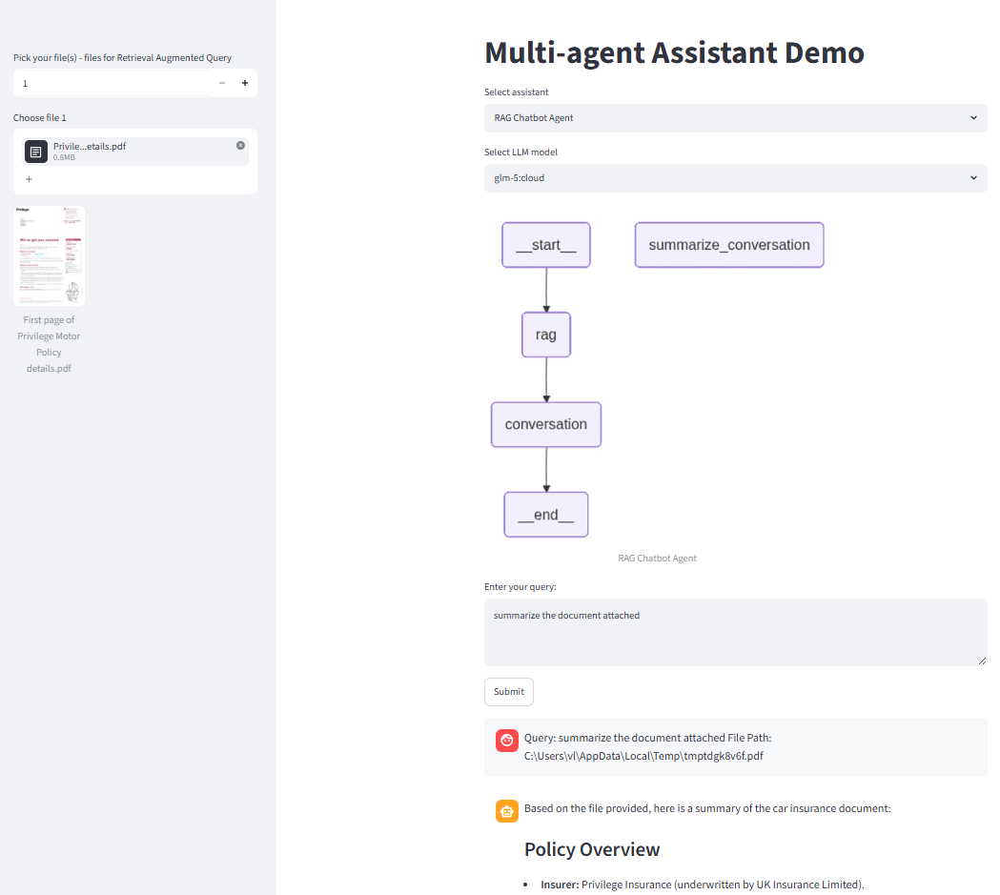

# langgraph_ollama

LangGraph + Ollama multi-agent / RAG experiments.

## Setup (uv)

This project uses [uv](https://docs.astral.sh/uv/) for environment and dependency
management. Dependencies are declared in `pyproject.toml` and pinned in `uv.lock`
(LangChain/LangGraph 0.3.x line on Python 3.12, using the `langchain-ollama`
partner package).

```bash
# Install Python 3.12 (uv manages the interpreter) and sync the locked env
# installed to %APPDATA%\uv\python
uv python install 3.12
uv sync

# Run the Streamlit app
uv run streamlit run app.py
```

Requires a running [Ollama](https://ollama.com/) server. You also need to pull the dedicated embedding model before using RAG features:

```bash
ollama pull nomic-embed-text
```

Configure your main text model and base URL via `.env`:

```
OLLAMA_MODEL=glm-5:cloud
OLLAMA_BASE_URL=http://localhost:11434
TAVILY_API_KEY=your_tavily_api_key_here
```

A generated `requirements.txt` is also exported from the lock for tooling that
needs it (`uv export --no-hashes -o requirements.txt`).


