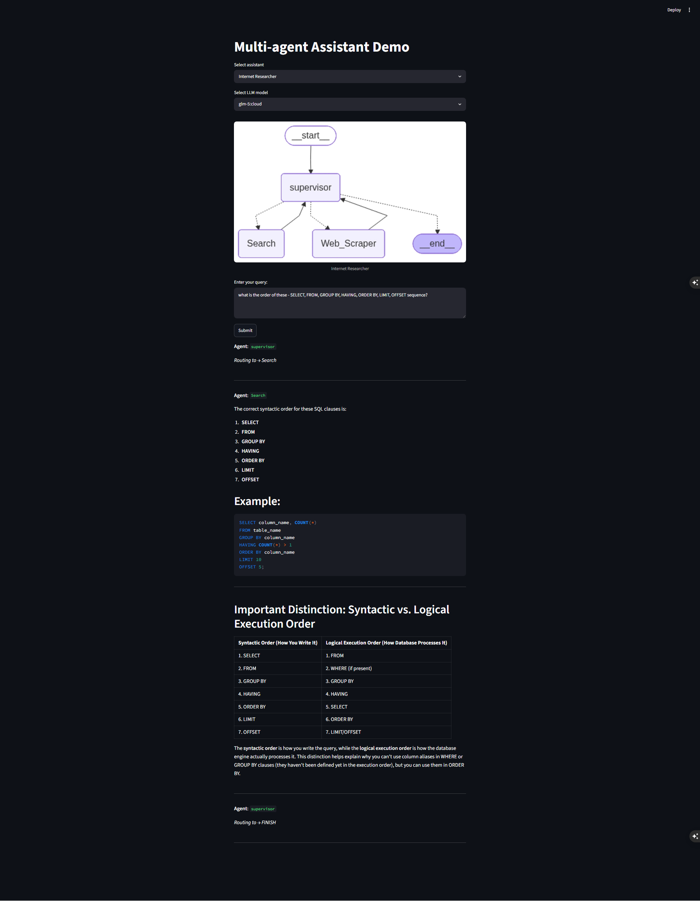
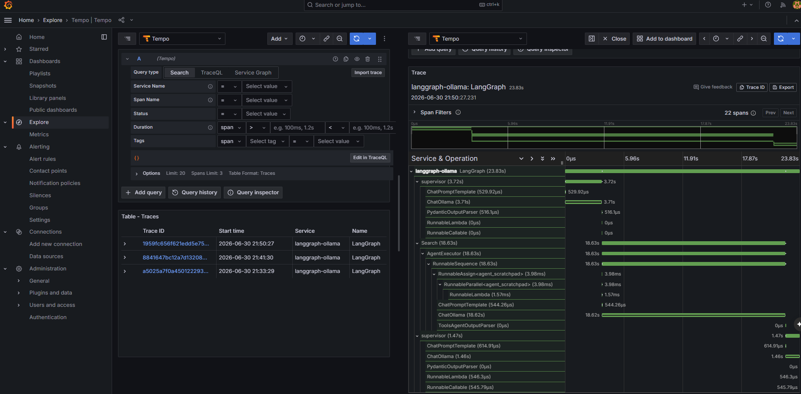

# langgraph_ollama

An autonomous coding agent, an execution-based eval harness to measure it, and the
observability and deployment scaffolding to run it — built on LangGraph against
local and gateway-hosted models.

> **Start here:** [**What an eval harness found in my coding agent**](EVAL_CASE_STUDY.md)
> — five defects, three of them in the measuring instrument, and what each cost.


---

## The Coding Engineer

A LangGraph state machine that takes a goal and a git repo and iterates until the
tests pass or it gives up and says why.

```
intake → author_bdd → plan_tot → code → self_check → bdd_gate → review → finalize

any gate fails  →  diagnose  →  retry under the same plan      (→ code)
                             →  switch to the next plan        (→ plan_tot)
                             →  give up, with a stated reason  (→ escalate)
```

`test_style=pytest` skips `author_bdd` and `bdd_gate` for targets where drafting
Gherkin first is the wrong shape of work.

- **Never edits your checkout.** Every run branches a git worktree off the target's
  HEAD onto `coding-engineer/<run_id>`. You review and merge yourself.
- **Escalation is a first-class outcome.** When the loop gives up it commits the WIP
  worktree, writes a report, and records *why* — `wall_clock`, `two_plans_exhausted`,
  `unsuitable goal` — rather than failing silently.
- **Failure signatures feed back into state.** A repeated signature trips a
  no-progress rule that switches plan rather than burning the budget on the same
  wrong idea. ([Why that signature must not be constant](EVAL_CASE_STUDY.md#4-every-non-lint-failure-reported-as-a-lint-failure).)
- **Resumable.** SqliteSaver checkpoints keyed by `run_id`; a killed run resumes where
  it stopped.
- **Traced.** Every LLM and tool call prints provider, model, endpoint, token counts,
  finish reason and a truncation warning — across both the native Ollama and
  OpenAI-compatible transports.

Three ways to drive it:

| | |
|---|---|
| **CLI** | `uv run python -m coding_agent.engine --target <repo> --goal "..."` |
| **HTTP** | `uv run uvicorn api.main:app --port 8009` → Swagger at `/docs` ([API docs](api/README.md)) |
| **Streamlit** | `uv run streamlit run app.py` |

Design notes: [`coding_agent/README.md`](coding_agent/README.md) ·
[`coding_agent/CODING_ENGINEER.md`](coding_agent/CODING_ENGINEER.md)

## The eval harness

Scores the agent by running **hidden unit tests** against the code it actually
produced — written into the worktree only after the agent has committed, so the score
cannot be gamed. Never LLM-as-judge.

```bash
uv run python -m evals.runner --validate   # hidden tests must FAIL on every seed
uv run python -m evals.runner --selftest   # hidden tests must PASS on every reference
uv run python -m evals.runner              # score the agent
```

8 tasks across bugfix / feature / refactor × easy / medium / hard. Reports Pass@1 and
**recovery rate** separately — the first mostly measures the model, the second
measures the graph around it. [`evals/`](evals/)

## Everything else

| | |
|---|---|
| **Internet Researcher** | Multi-step web research agent (Tavily + LangGraph) |
| **RAG chat** | Document Q&A over local embeddings (`nomic-embed-text`) |
| **Observability** | OpenTelemetry → Tempo / Loki / Prometheus / Grafana ([`observability/`](observability/)) |
| **Deployment** | Dockerfile, Helm chart and Kubernetes manifests ([`k8s/`](k8s/), [`helm/`](helm/)) |




---

## Setup

Uses [uv](https://docs.astral.sh/uv/); dependencies in `pyproject.toml`, pinned in
`uv.lock` (Python 3.12).

```bash
uv python install 3.12
uv sync                              # or: uv sync --extra observability
ollama pull nomic-embed-text         # required for RAG
uv run streamlit run app.py
```

Requires a running [Ollama](https://ollama.com/) server, or any OpenAI-compatible
gateway. Configure via `.env`:

```
OLLAMA_MODEL=glm-5.2:cloud
OLLAMA_BASE_URL=http://localhost:11434
TAVILY_API_KEY=your_tavily_api_key_here

# Coding Engineer — provider must match the base URL, or you get 404s
CODING_AGENT_PRIMARY_PROVIDER=ollama          # ollama | openai
CODING_AGENT_PRIMARY_MODEL=glm-5.2:cloud
CODING_AGENT_PRIMARY_BASE_URL=http://localhost:11434
CODING_AGENT_MAX_TOKENS=8192                  # per-call output ceiling
CODING_AGENT_LOG_LLM=1                        # 0 off, 1 default, 2 with previews
```

`requirements.txt` is exported from the lock for tooling that needs it
(`uv export --no-hashes -o requirements.txt`).
