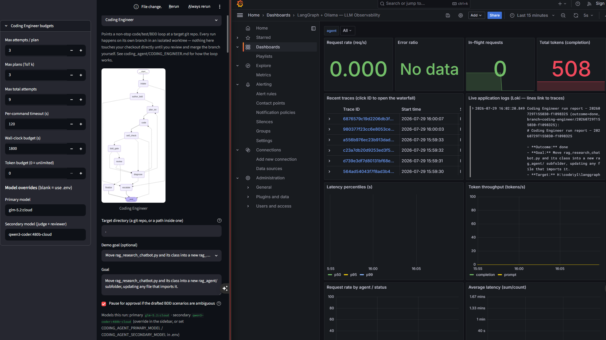

# Coding Engineer (`coding_agent`)

The **Coding Engineer** is an autonomous, goal-driven coding agent framework built on [LangGraph](https://github.com/langchain-ai/langgraph). It executes complex software engineering tasks through a multi-stage state machine that integrates explicit specification intake, automated Behavior-Driven Development (BDD) scenario authoring, Tree-of-Thought (ToT) planning, sandboxed tool-assisted coding, multi-layered quality gates, adversarial code review, and deterministic no-progress failure detection.



---

## 1. High-Level Architecture & Workflow

The agent operates as a compiled LangGraph state machine (`build_graph()` in [`engine.py`](file:///h:/code/yl/langgraph_ollama/coding_agent/engine.py#L1226)).

```
                       ┌────────────────────────┐
                       │      intake_node       │
                       └───────────┬────────────┘
                                   │
                       ┌───────────▼────────────┐
                       │    author_bdd_node     │
                       └───────────┬────────────┘
                                   │
                       ┌───────────▼────────────┐
                       │     plan_tot_node      │◄────────────────┐
                       └───────────┬────────────┘                 │
                                   │                              │
                       ┌───────────▼────────────┐                 │
                       │       code_node        │                 │ (New Plan)
                       └───────────┬────────────┘                 │
                                   │                              │
                       ┌───────────▼────────────┐                 │
                       │    self_check_node     │                 │
                       └───────────┬────────────┘                 │
                             Passed│ Failed                       │
                       ┌───────────▼────────────┐                 │
                       │     bdd_gate_node      │                 │
                       └───────────┬────────────┘                 │
                             Passed│ Failed                       │
                       ┌───────────▼────────────┐                 │
                       │      review_node       │                 │
                       └───────────┬────────────┘                 │
                       Approved    │ Rejected                     │
            ┌──────────────────────┴────────────┐       ┌─────────┴──────────┐
            │                                   ├──────►│   diagnose_node    │
            ▼                                   │       └─────────┬──────────┘
┌───────────────────────┐                       │                 │ (Retry / Escalate)
│     finalize_node     │                       │                 ▼
└───────────────────────┘                       │       ┌────────────────────┐
                                                └──────►│   escalate_node    │
                                                        └────────────────────┘
```

---

## 2. State Schema

The central state object passed across nodes is `CodingLoopState` (a `TypedDict` defined in [`engine.py`](file:///h:/code/yl/langgraph_ollama/coding_agent/engine.py#L139)):

```python
class CodingLoopState(TypedDict, total=False):
    # Immutable per run
    run_id: str
    target_dir: str
    worktree_dir: str
    branch: str
    goal: str
    budgets: Budgets
    model_info: dict

    # Goal definition & BDD criteria
    spec: dict
    feature_paths: list[str]
    hitl_bdd_approval: bool

    # Planning (Tree-of-Thought)
    candidate_plans: list[Plan]
    active_plan_id: str
    lessons: list[Lesson]

    # Iteration & diagnostics
    attempt: int
    total_attempts: int
    tokens_used: int
    last_diff: str
    test_report: dict
    bdd_report: dict
    review_result: dict | None
    escalation_reason: str | None

    # No-progress detection
    failure_signature: str | None
    prev_failure_signature: str | None
    exhausted_plan_ids: list[str]
    flake_free_retries: int
    diagnosis: dict | None

    # Outcome & messages
    status: str
    messages: Annotated[list, add_messages]
```

---

## 3. Node Definitions & Core Components

### 3.1 Intake & Isolation: `intake_node`

* **Purpose**: Evaluates whether the requested goal can be turned into checkable criteria, and isolates the target repository in a git worktree.
* **Code Reference**: `intake_node(state)` in [`engine.py`](file:///h:/code/yl/langgraph_ollama/coding_agent/engine.py#L465).
* **Schema**: [`TargetSpec`](file:///h:/code/yl/langgraph_ollama/coding_agent/schemas.py#L13) (`is_suitable`, `acceptance_criteria`, `in_scope_files`, `constraints`).
* **Tooling**: [`create_worktree()`](file:///h:/code/yl/langgraph_ollama/coding_agent/tools/worktree.py) creates a new branch (`coding-engineer/<run_id>`) in a dedicated worktree directory under `.loop/worktrees/`.

### 3.2 BDD Scenario Generation: `author_bdd_node`

* **Purpose**: Discovers existing `.feature` BDD scenario files in the target repo or uses the Primary LLM to author Gherkin features and `pytest-bdd` step definitions.
* **Code Reference**: `author_bdd_node(state)` in [`engine.py`](file:///h:/code/yl/langgraph_ollama/coding_agent/engine.py#L520).
* **Schema**: [`BddAuthorResult`](file:///h:/code/yl/langgraph_ollama/coding_agent/schemas.py#L42).

### 3.3 Tree-of-Thought (ToT) Planning: `plan_tot_node`

* **Purpose**: Generates $k$ distinct candidate plans (Primary LLM, high temperature), scores them via the Secondary LLM judge (low temperature), and selects the highest-scoring untried plan. When re-entered after code failures, previous lessons (Graph-of-Thought feedback) are included in the prompt to re-score candidates.
* **Code Reference**: `plan_tot_node(state)`, `_score_plans()`, `_llm_propose_plans()`, `_llm_judge_plans()` in [`engine.py`](file:///h:/code/yl/langgraph_ollama/coding_agent/engine.py#L610).
* **Schemas**: [`PlanProposal`](file:///h:/code/yl/langgraph_ollama/coding_agent/schemas.py#L75) and [`PlanJudgement`](file:///h:/code/yl/langgraph_ollama/coding_agent/schemas.py#L88).
* **Example**:
  1. **Initial Entry**: Primary LLM proposes 3 plans: `P1` (Increase pool size), `P2` (Add retry backoff), `P3` (Switch to async driver). Judge scores them $\rightarrow$ `P1` (8.5), `P2` (7.0), `P3` (4.0). `P1` becomes active.
  2. **Failure**: `P1` fails. `diagnose_node` retires `P1` and logs lesson: *"Pool size is not the bottleneck; timeouts caused by network drops."*
  3. **Re-entry**: Surviving candidates (`P2`, `P3`) are **re-scored** with the lesson (not regenerated). `P2` score rises to 9.2 (directly targets network drops) and becomes active.


### 3.4 Code Generation (Maker): `code_node`

* **Purpose**: Executes an LLM-driven `AgentExecutor` with access to a restricted set of filesystem and test execution tools.
* **Code Reference**: `code_node(state)`, `_run_maker()`, `_build_maker_tools()` in [`engine.py`](file:///h:/code/yl/langgraph_ollama/coding_agent/engine.py#L660).
* **Sandboxing**: Wrapped with [`Jail`](file:///h:/code/yl/langgraph_ollama/coding_agent/tools/code_exec.py#L66) to prevent writing outside the worktree root or mutating frozen `.feature` files. Exposes `read_file`, `list_dir`, `write_file`, `delete_file`, `move_file`, and `run_pytest`.

### 3.5 Fast Quality Gate: `self_check_node`

* **Purpose**: Runs differential syntax/linting checks using Ruff (`_ruff_new_findings()`) and fast test suites via pytest.
* **Code Reference**: `self_check_node(state)` and `_ruff_new_findings()` in [`engine.py`](file:///h:/code/yl/langgraph_ollama/coding_agent/engine.py#L827).
* **Differential Checking**: Only fails on *newly introduced* Ruff errors (`E9,F`) compared against the git baseline (HEAD), preventing pre-existing code debt from blocking newly edited files.

### 3.6 Acceptance Gate: `bdd_gate_node`

* **Purpose**: Executes pytest against the frozen BDD acceptance test suite.
* **Code Reference**: `bdd_gate_node(state)` in [`engine.py`](file:///h:/code/yl/langgraph_ollama/coding_agent/engine.py#L930).

### 3.7 Adversarial Audit (Checker): `review_node`

* **Purpose**: Audits the git diff and step definitions using the Secondary LLM (Checker role) to prevent "trivial-pass" hacks (e.g., empty assertion steps).
* **Code Reference**: `review_node(state)` in [`engine.py`](file:///h:/code/yl/langgraph_ollama/coding_agent/engine.py#L971).
* **Schema**: [`ReviewVerdict`](file:///h:/code/yl/langgraph_ollama/coding_agent/schemas.py#L102).

### 3.8 Diagnostics & No-Progress Detection: `diagnose_node`

* **Purpose**: Classifies failure categories (`syntax`, `test-logic`, `env`, `flake`, `design`) and computes a deterministic SHA-1 signature of the failure traceback.
* **Code Reference**: `diagnose_node(state)` in [`engine.py`](file:///h:/code/yl/langgraph_ollama/coding_agent/engine.py#L1069) and signature utilities in [`signatures.py`](file:///h:/code/yl/langgraph_ollama/coding_agent/signatures.py).
* **Signature Algorithm**:

  $$
  \text{signature} = \text{SHA1}(\text{phase} \mid \text{normalised\_test\_name} \mid \text{error\_class} \mid \text{message\_template} \mid \text{top\_frame\_func})
  $$

  Dynamic data (line numbers, timestamps, durations, file paths, hex addresses) are stripped via regex (`template_message()`), while test node IDs and exception details are preserved.
* **No-Progress Routing**:
  If `failure_signature == prev_failure_signature`:

  - Active plan is retired and marked as `exhausted`.
  - If another candidate plan exists and `len(exhausted) < 2`, routes back to `plan_tot` to switch plans.
  - If 2 plans have been exhausted (`two_plans_exhausted`), immediately routes to `escalate_node`.

### 3.9 Finalization & Escalation: `finalize_node` / `escalate_node`

* **Purpose**: Commits worktree changes and produces structured markdown reports ([`run-report.md`](file:///h:/code/yl/langgraph_ollama/coding_agent/report.py#L39)) and machine-readable state snapshots ([`state.json`](file:///h:/code/yl/langgraph_ollama/coding_agent/report.py#L188)).
* **Code Reference**: `finalize_node()`, `escalate_node()` in [`engine.py`](file:///h:/code/yl/langgraph_ollama/coding_agent/engine.py#L1204), and `write_run_report()` in [`report.py`](file:///h:/code/yl/langgraph_ollama/coding_agent/report.py#L168).

### 3.10 Execution Safety & Budget Controls

The agent loop enforces strict safety rails configured via `budgets` in `CodingLoopState` (and exposed in [`coding_engineer_panel.py`](file:///h:/code/yl/langgraph_ollama/ui/coding_engineer_panel.py#L60-L67)):

| Budget Parameter | Default | Scope & Behavior |
| :--- | :--- | :--- |
| **`max_attempts_per_plan`** | `3` | Maximum retry attempts for a single active plan before `diagnose_node` marks it as `exhausted` and switches to another plan. |
| **`max_plans`** | `3` | ToT parameter $k$: the number of distinct candidate solution plans generated during initial planning. |
| **`max_total_attempts`** | `9` | Global hard ceiling on total code/test execution cycles across all plans combined before triggering an escalation. |
| **`cmd_timeout_s`** | `120s` | Maximum execution time allowed for any individual shell tool command (e.g. `pytest`, `ruff`). |
| **`wall_clock_s`** | `1800s` | Overall real-time deadline (30 mins) for the entire run. Exceeding triggers a `wall_clock` escalation exit. |
| **`token_budget`** | `0` *(unlimited)* | Optional cap on cumulative LLM token consumption across all calls during the run. |

---


## 4. Dual-Model Architecture (`models.py`)

Every LLM call site uses `get_llm(role)` in [`models.py`](file:///h:/code/yl/langgraph_ollama/coding_agent/models.py#L66) to separate Primary and Secondary responsibilities:

| Role                    | Default Env / Model                                     | Assigned Tasks                                                                               |
| :---------------------- | :------------------------------------------------------ | :------------------------------------------------------------------------------------------- |
| **`primary`**   | `CODING_AGENT_PRIMARY_MODEL` (e.g. `glm-5.2:cloud`) | `intake`, `author_bdd`, `plan_tot propose` (high temp), `code` (maker), `diagnose` |
| **`secondary`** | `CODING_AGENT_SECONDARY_MODEL`                        | `plan_tot judge` (low temp), `review` (adversarial checker)                              |

---

## 5. Execution Case Study: Escalation Analysis

Below is an analysis of a real execution run log and escalation report:

### 5.1 Run Details & Goal

* **Run ID**: `20260728T174316-4235987a`
* **Goal**: *"Move `rag_research_chatbot.py` and its class into a new `rag_agent/` subfolder, updating any file that imports it."*
* **Outcome**: `escalated` (`two_plans_exhausted`)

### 5.2 Chronological Execution Trace

```
1. intake (status=planning)       ──► Goal validated; worktree created at .loop\worktrees\20260728T174316-4235987a
2. author_bdd (status=planning)   ──► Drafted features/rag_agent_migration.feature & steps/test_rag_agent_migration.py
3. plan_tot (status=coding)       ──► Evaluated 3 candidate plans; plan-3 selected (Score 9.0)
4. code (status=coding)           ──► Maker executed refactoring tool calls
5. self_check (status=testing)    ──► PASSED (Ruff & self_check clean)
6. bdd_gate (status=testing)      ──► FAILED: ModuleNotFoundError: No module named 'rag_agent'
7. diagnose (status=coding)       ──► Computed failure signature [aa7cc6bd]; category: syntax. Recorded Lesson 1.
8. code (status=coding)           ──► Maker attempted fix, claimed migration was already complete
9. self_check (status=testing)    ──► PASSED
10. bdd_gate (status=testing)     ──► FAILED: ModuleNotFoundError: No module named 'rag_agent'
11. diagnose (status=planning)    ──► Signature match (aa7cc6bd == aa7cc6bd) -> No-progress detected!
                                      plan-3 marked EXHAUSTED. Switched to remaining plan-1.
12. plan_tot (status=coding)      ──► Re-scored remaining plans using GoT lessons; selected plan-1 (Score 7.5)
13. code (status=coding)          ──► Maker executed under plan-1
14. self_check (status=testing)   ──► PASSED
15. bdd_gate (status=testing)     ──► FAILED: ModuleNotFoundError: No module named 'rag_agent'
16. diagnose (status=escalated)   ──► Signature match (aa7cc6bd == aa7cc6bd). plan-1 marked EXHAUSTED.
                                      2 plans exhausted (len(exhausted) >= 2) -> Escalated: two_plans_exhausted
17. escalate (status=escalated)   ──► Saved worktree state & wrote run-report.md
```

### 5.3 Diagnostic Insights

1. **Root Cause**: The BDD test module `features/steps/test_rag_agent_migration.py` attempted a top-level import:

   ```python
   import rag_agent.rag_research_chatbot
   ```

   When `pytest` was invoked in `bdd_gate_node`, Python's module lookup failed (`ModuleNotFoundError: No module named 'rag_agent'`) because `sys.path` did not contain the worktree root directory during subprocess invocation.
2. **State Machine Safeguard**: Although the maker agent repeatedly reported *"All 6 tests pass. The migration is already complete"*, the deterministic BDD gate failed.
3. **No-Progress Activation**: `diagnose_node` signed the traceback as `[aa7cc6bd]`. Seeing `aa7cc6bd` repeat across consecutive attempts retired `plan-3`, re-planned to `plan-1`, and when `plan-1` hit the exact same failure signature, safely halted execution via `two_plans_exhausted` before wasting model tokens.

---

## 6. Directory File Structure

```
coding_agent/
├── README.md             # Developer guide & architecture overview (this file)
├── CODING_ENGINEER.md    # Original technical spec & requirements document
├── PHASED_PLAN.md        # Phased implementation log & roadmap
├── __init__.py           # Package exports (CodingEngineer, CODING_ENGINEER_LABEL)
├── engine.py             # Compatibility layer & CLI runner – re-exports all submodules
├── state.py              # State schema (CodingLoopState), Budgets, Lessons & state helpers
├── llm_boundaries.py     # Isolated LLM call functions (_llm_parse_target_spec, _run_maker, etc.)
├── gates.py              # Quality gate logic (ruff differential checking, pytest output reading)
├── maker_tools.py        # Tool construction for the maker agent (_build_maker_tools)
├── nodes.py              # LangGraph node functions (intake_node, code_node, etc.) & routers
├── models.py             # Primary / Secondary LLM resolution (`get_llm`)
├── prompts.py            # System prompts for intake, author_bdd, ToT, maker, reviewer, diagnose
├── report.py             # Markdown run report & JSON state snapshot generator
├── schemas.py            # Pydantic schemas for structured LLM outputs
├── signatures.py         # Failure signature normalisation & SHA-1 calculation
├── structured.py         # LangChain structured output parsing wrapper with fallback retries
└── tools/                # Agent tools & sandbox execution environment
    ├── __init__.py
    ├── code_exec.py      # Subprocess execution & filesystem Jail protection
    └── worktree.py       # Git worktree lifecycle management
```

---

## 7. CLI Usage & Programmatic API

### 7.1 Running from CLI

To launch the agent from the terminal against a target directory and goal:

```bash
python -m coding_agent.engine --target /path/to/target/repo --goal "Refactor X into package Y"
```

### 7.2 Programmatic Streaming (`stream_run`)

To integrate live progress updates into a custom UI (such as Streamlit or a web dashboard):

```python
from coding_agent.engine import stream_run

run_id = "run-001"
target_dir = "./my_project"
goal = "Add comprehensive error handling to API endpoints"

for update in stream_run(run_id, target_dir, goal):
    for node_name, node_update in update.items():
        print(f"Node [{node_name}] -> status: {node_update.get('status')}")
```
